# BearCart - PalSU Campus Marketplace

> A full-stack Next.js campus marketplace that lets verified Palawan State University students and faculty buy, sell, and request items within their campus community - with Google SSO restricted to PalSU accounts, real-time chat, and protected by a multi-layer content moderation pipeline.

---

## Project Information

| Field | Details |
|-------|---------|
| Subject | Web Systems and Technologies|
| Academic Year | 2025–2026 |
| Project Category | Web Development/ Marketplace |
| Instructor | Ma'am Divine Grace Caabay |

### Members

* Dianara Kristy D. Garciano
* Ross Ivan T. Venturillo

---

## Project Description

BearCart is a web-based campus marketplace built exclusively for the Palawan State University community in Puerto Princesa City. It exists because general platforms like Facebook Marketplace and Shopee don't filter by campus - making it hard to find sellers you can actually walk to. BearCart solves this by restricting access to verified PalSU accounts through institutional Google SSO (`@psu.palawan.edu.ph`) and keeping every transaction local:same community, face-to-face meetups.

Students and faculty can post items they want to sell, browse listings from fellow Bearcats, and post **requests** for things they're looking for. Buyers and sellers connect through real-time, one-to-one chat scoped to a specific listing or request, with read receipts, image sharing, online presence, and email nudges when a message goes unread.

Trust is the product. Because every account is verified through the university Google Workspace, the marketplace feels like a campus bulletin board that actually works. Safety is enforced by a three-layer content moderation pipeline (a local profanity filter, hardcoded blacklists/whitelists, and OpenAI's omni-moderation for text and images) that runs before anything is published, plus a community reporting system that auto-delists posts at a report threshold. An admin dashboard gives moderators full oversight: platform statistics, a 7-day reports chart, moderation queues for reported listings/requests/messages, and tools to warn, ban, delist, restore, or take down content - each action notifying the affected user by in-app notification and email.

---

## Features

* **PalSU-Only Google SSO** - Login is restricted to `@psu.palawan.edu.ph` accounts via Google OAuth (`hd` domain hint), so the whole community is verified
* **Guided Onboarding** - First-time users pick a role and college
* **Listings** - Post items for sale with photos, price, negotiable flag, category, and condition; browse, search, filter, and sort
* **Requests** - Post what you're *looking for* (with budget range and urgency) so sellers can reach out to you
* **Slug-based URLs** - Human-readable listing/request/profile URLs generated on create
* **Real-Time Chat** - One-to-one messaging scoped to a listing or request, with attachments, read receipts, soft delete, archive/unarchive, and online presence.
* **Smart Email Nudges** - If a chat message stays unread for an amount of time, the recipient gets a branded email (debounced to at most one per conversation per 30 minutes)
* **Three-Layer Content Moderation** - leo-profanity (English + Tagalog) → hardcoded blacklists/whitelists → OpenAI omni-moderation for both text and images, run before any post is saved
* **Community Reporting & Auto-Delist** - Users report listings, requests, or messages; posts auto-delist at the report threshold and admins are emailed
* **Rate Limiting** - Upstash Redis sliding-window limits
* **In-App Notifications** - Real-time bell + notifications page for messages, saves, reviews, and moderation events.
* **Admin Dashboard** - Platform stats (users, listings, requests, sold, banned users, pending reports), a 7-day reports chart, recent-activity feed, auditing, and moderation queues with one-click takedown / restore / warn / ban

---

## Technologies Used

* **TypeScript** - Core programming language
* **Next.js 16 (App Router)** - Full-stack React framework (server components, server actions, route handlers)
* **React 19** - UI library
* **Supabase** - Postgres database, Authentication, Storage, and Realtime
* **PostgreSQL** - Database with Row-Level Security, triggers, and RPC functions
* **Tailwind CSS 4** - Utility-first styling
* **shadcn/ui + Radix UI** - Accessible component primitives
* **@phosphor-icons/react** - Icon library (Regular weight throughout)
* **Nodemailer + Brevo SMTP** - Transactional email delivery (welcome, message, moderation notices)
* **OpenAI omni-moderation** - AI moderation of user text and images
* **leo-profanity** - Library for dictionary-based profanity filtering, extended with a custom Filipino dictionary, used as a fast first-pass filter before AI moderation
* **Upstash Redis + @upstash/ratelimit** - Sliding-window rate limiting
* **Sharp** - Server-side image processing (WebP conversion / optimization)
* **Zod + React Hook Form** - Form validation

---

### Screenshots

**Home / Landing Page**
> The main landing page introducing BearCart with a hero section, featured listings, and tabs for browsing items and requests.
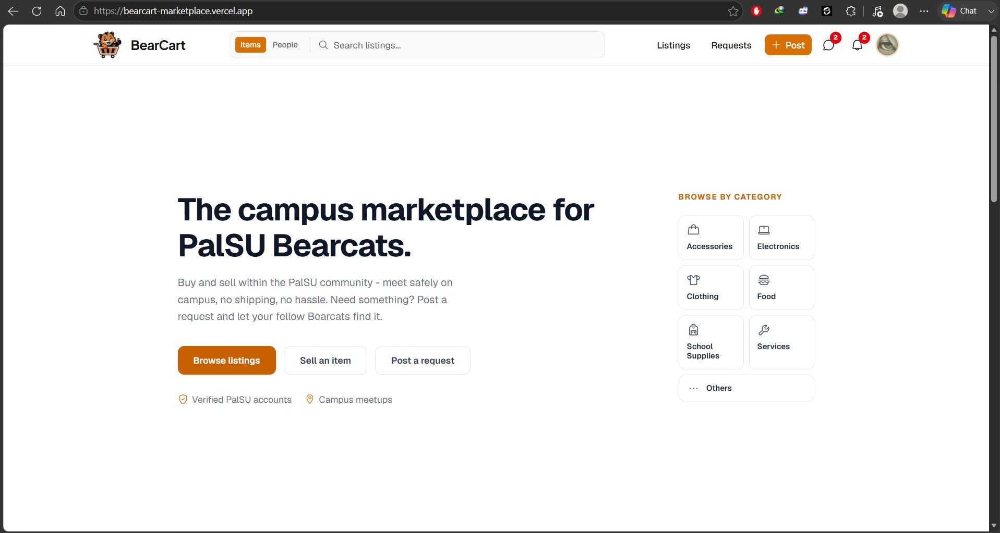

**Setup / Onboarding**
> First-time users choose their role and college before entering the marketplace.
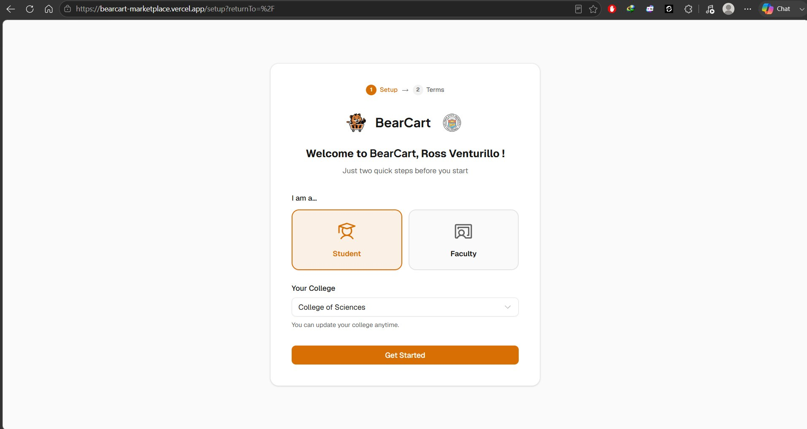

**Consent / Terms**
> New users review and accept the Terms of Service and Privacy Policy before posting.
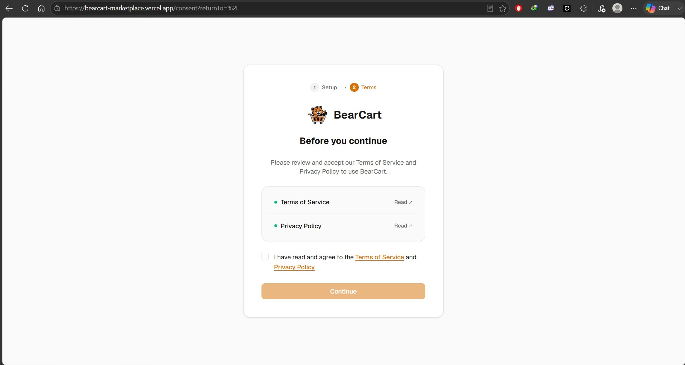

**Listings Browse**
> Grid of campus listings with search, category filters, condition, sorting, and pagination.
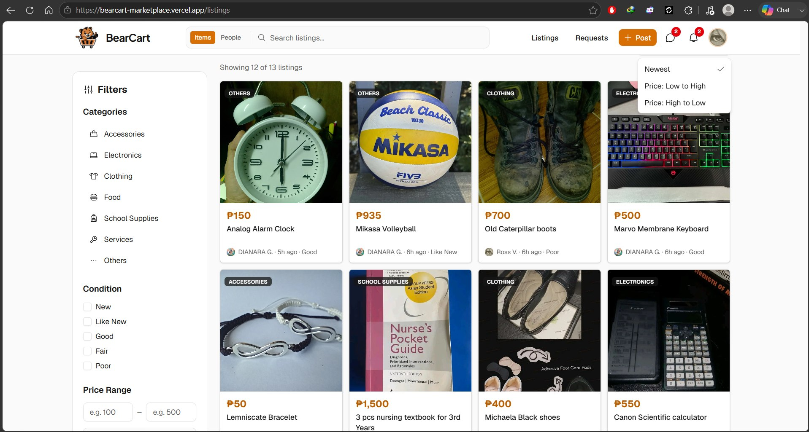

**Listing Detail**
> A single listing with photo gallery, price, condition, seller info card, and a "Message Seller" action.
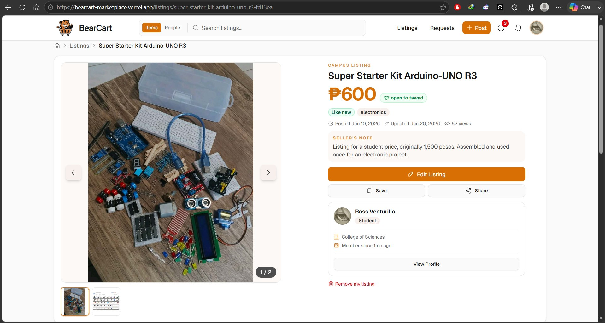

**Browse Requests**
> Bulletin board of "looking for" requests posted by the campus, with budget range and urgency.
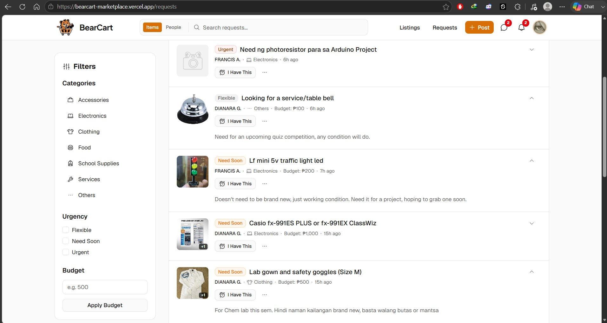

**Post a Listing/Request**
> Form to post an item for sale - photos, title, description, price, negotiable flag, category, and condition - with content moderation on submit.
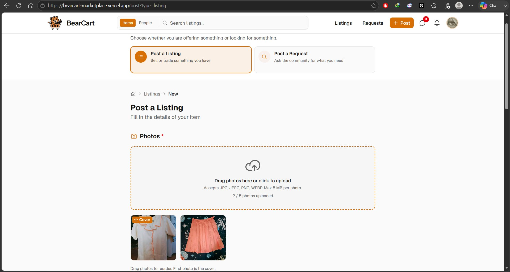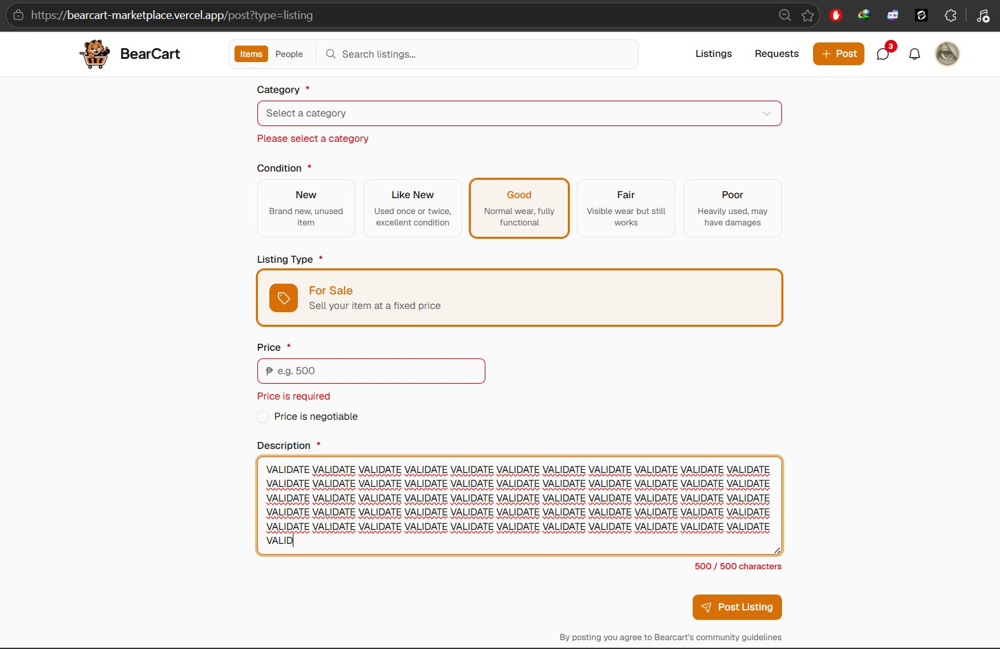

**Profanity Filtering → Blacklisted Words → Omni-Moderation Model**
> Three layer pipeline moderation for both text and attachments
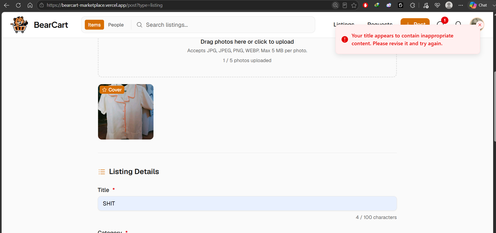 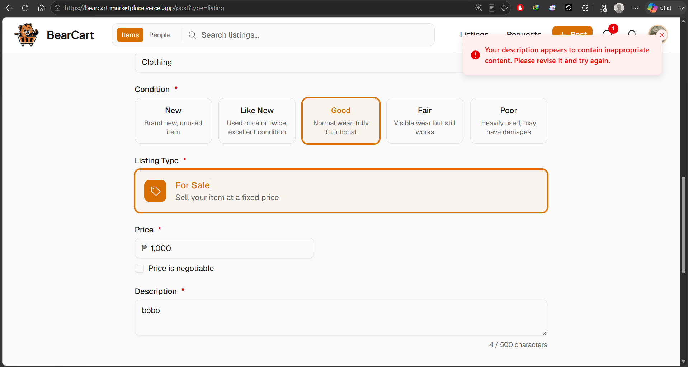 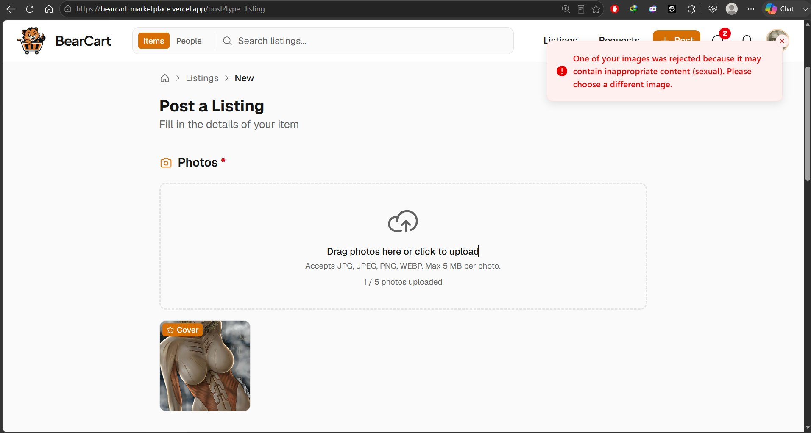 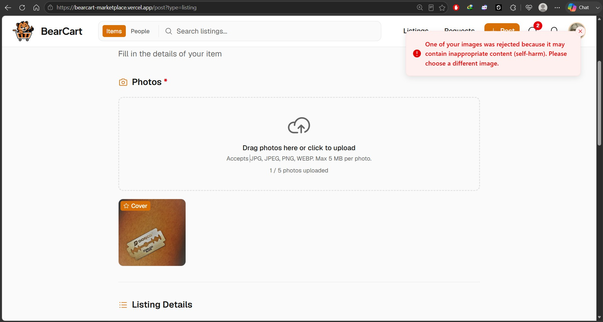

**Messages / Chat**
> Real-time one-to-one chat scoped to a listing or request, with conversation list, image attachments, read receipts, and online presence.
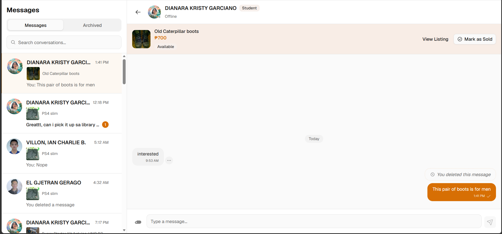

**Profile**
> A user's profile showing their active listings, items sold, requests, and reviews (self-only).
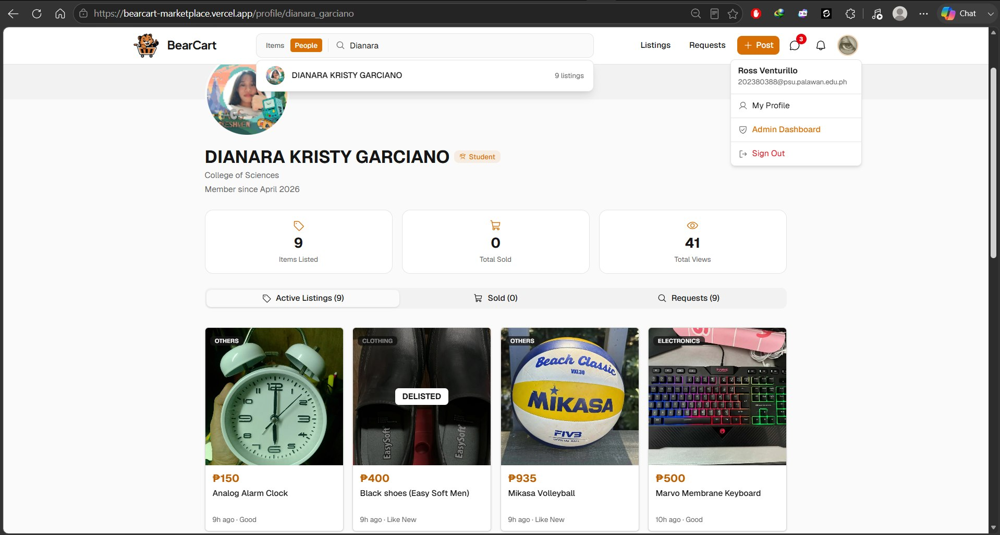

**Admin Dashboard**
> Platform-wide overview with summary statistics (users, listings, requests, sold, banned users, pending reports) activity log with auditing and a 7-day reports chart.
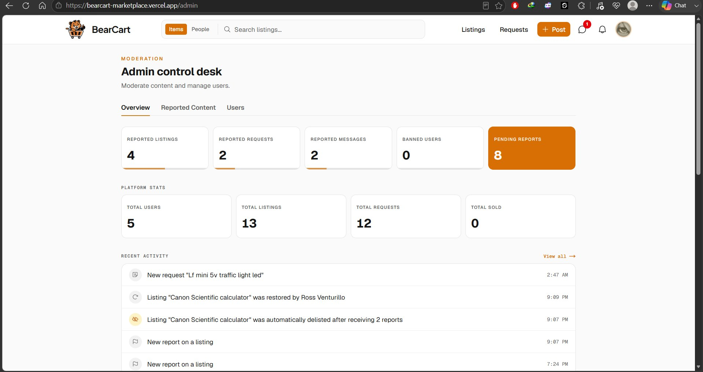 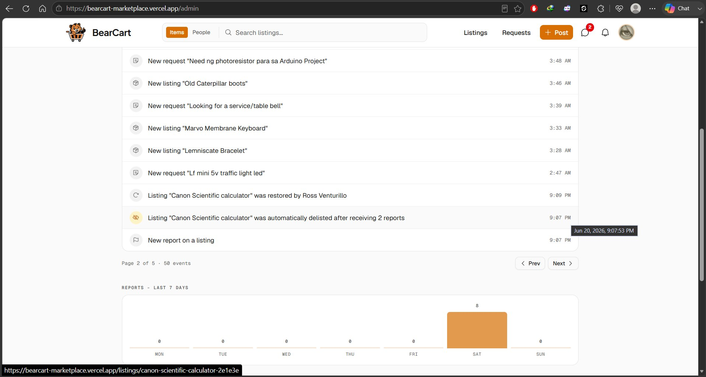

**Admin - Reported Content Queue**
> Moderation queues for reported listings, requests, and messages, with report reasons and one-click delist / takedown / restore / warn / ban actions.
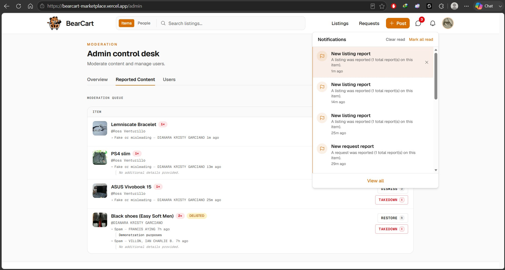 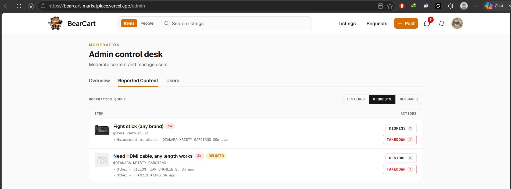 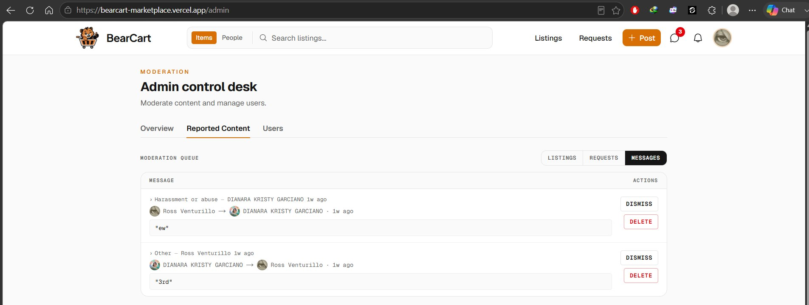

**Welcome Email**
> The  welcome email sent once after onboarding, introducing the marketplace.
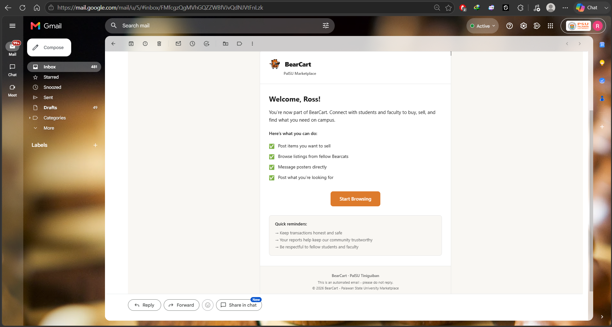

---

## Live Demo

* **Live URL:** https://bearcart-marketplace.vercel.app

---

## Video Demonstration

* Video Link: https://www.youtube.com/watch?v=fc8DUKcnBAI

---

## Future Improvements

* **Multiple Quantities** - Currently, each listing represents a single item. Future versions could allow sellers to specify quantity (e.g., "5 available"), with the system automatically tracking stock and marking a listing as sold out once quantity reaches zero, rather than requiring a new post for each identical item.

* **Rating System** - Introduce a transaction tracking feature that allows both buyer and seller to mark a deal as completed, which would then unlock the ability to rate and review each other for that specific transaction.

* **Other Branches** - During onboarding, allow users to select which PalSU branch they belong to. This selection would then filter the marketplace shown to them, so users see items relevant to their own campus instead of a mixed feed from every branch.

* **Video Inside Detailed Post** - Allow sellers to attach short video clips to their listings in addition to photos.

* **Standardized Picture Format** - Impelement a standardized crop and aspect ratio during upload, ensuring every image displays at a consistent size and shape.

* **Dedicated Mobile App** - Develop a cross-platform mobile application to complement the web platform.
